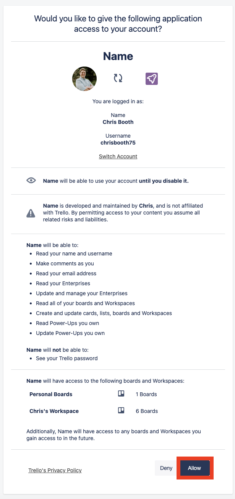

# Nest Trello Application
This is the README for the Nest.js-based Trello application. This application allows you to interact with Trello boards and manage tasks within them. It provides API endpoints to fetch tasks from a Trello board, save them to a local database, and retrieve saved tasks.

## Prerequisites
Before you begin, ensure you have the following installed:

* Node.js and yarn (or npm)
* SQLite (for local development)
* Trello API credentials (API Key and API Token)
* Git (optional)

## Installation
1. Clone the repository (or download the code):

`git clone <repository-url>`

2. Navigate to the project directory:

`cd nest-trello-app`

3. Install dependencies using yarn (this application uses yarn):

`yarn install`

## Configuration
1. Get your <a href="https://developer.atlassian.com/cloud/trello/guides/rest-api/api-introduction/#managing-your-api-key" target="_blank">Trello API credentials</a> by following these steps:

    <ol type="a">
    <li>Login in to Trello</li>
    <li>For generating an API key, you first need to have created a Trello Power-Up. Go to <a href="https://trello.com/power-ups/admin" target="_blank">your Power-Up admin page</a> to set one up.</li>
    <li>Click on 'New' to create a new powerup.</li>
    
    <li>Fill in the relevant details in the form below. You do not need to have an Iframe connector URL, but make sure all the other fields are filled - including the support email address. Then click on Create.</li>
    
    <li>Once the Power-Up is created, you will be redirected to the API Key page. Click 'Generate a new API key. You will then have access to the API key.</li>
    
    <li>Click on generate a Token and then click allow.</li>
    
    
    <li>You will now have access to the API Token.</li>
    
    </ol> 

2. Create a `.env` file in the root of your project and add your Trello API credentials:

`TRELLO_API_KEY="your-trello-api-key"`
`TRELLO_API_TOKEN="your-trello-api-token"`

Replace "your-trello-api-key" and "your-trello-api-token" with your actual Trello API credentials. The application makes use of configServices to retrieve the tokens from the .env file:

`this.apiKey = this.configService.get<string>('TRELLO_API_KEY');`
`this.apiToken = this.configService.get<string>('TRELLO_API_TOKEN');`

3. Configure the `ormconfig.json file if needed. By default, it uses an SQLite database. Make sure the database configuration matches your environment.

## Usage
1. Start the application in development mode:

`yarn start:dev`

2. Open a web browser and navigate to http://localhost:3000.

3. Enter the URL of the Trello board you want to manage, e.g., https://trello.com/b/boardId/boardName.

4. Click the "Submit" button to fetch and display the tasks from the Trello board.

## File Structure
The application is organized into several files and directories:

* src/trello/trello.controller.ts: The NestJS controller for managing Trello tasks.
* src/trello/trello.entity.ts: The Entity representing Trello tasks in the database.
* src/trello/trello.module.ts: The NestJS module for Trello-related components.
* src/trello/trello.service.ts: The service that interacts with the Trello API and manages tasks.
* src/app.module.ts: The main application module, where other modules are imported.
* src/main.ts: The entry point for the application.
* views/task-form.ejs: This EJS file represents the HTML form where users can input a Trello Board URL. It includes an input field and a submit button for users to submit the URL. When the form is submitted, it sends a POST request to /trello/submit to process the input.
* views/tasks.ejs: This EJS file is the template for displaying a list of Trello tasks retrieved from the Trello board. It dynamically renders the task names, descriptions, and due dates (if available) in an HTML list. Users can also input a Trello Board URL in this view, similar to task-form.ejs, allowing for easy navigation between entering a URL and viewing tasks.

## Tests
The application includes unit tests for the TrelloService. You can run the tests with the following command:

`yarn test`

## Contributing
Contributions are welcome! If you'd like to contribute to this project, please follow the standard GitHub Fork and Pull Request workflow.

## License
This project is licensed under the UNLICENSED License - see the LICENSE file for details.

